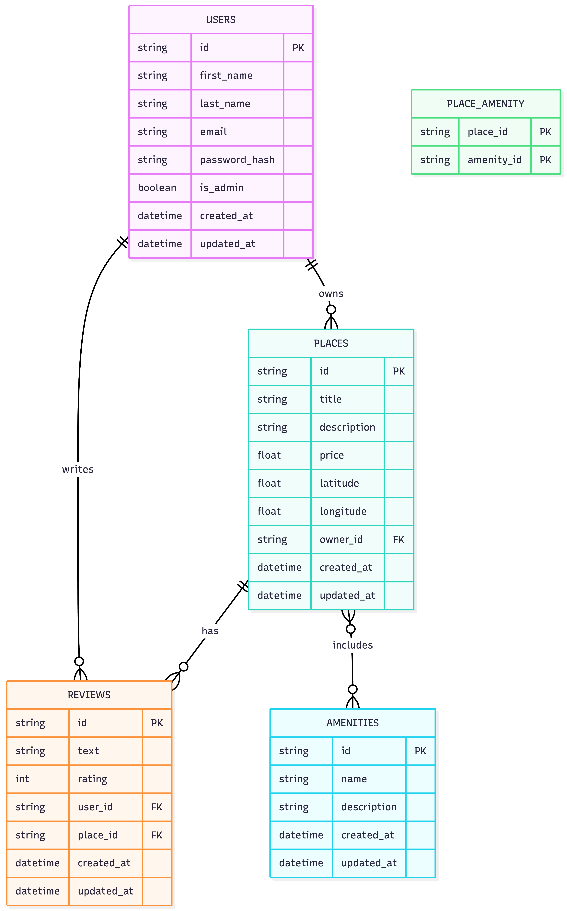

# Entity-Relationship (ER) Diagram

This document presents the Entity-Relationship (ER) diagram for the HBnB database schema.

## Overview

The ER diagram illustrates the structure of the database and the relationships between the core entities:
- User
- Place
- Review
- Amenity
- Place_Amenity

It reflects the database design implemented in Part 3 of the project, including primary keys, foreign keys, and relationship types.

## Entities and Relationships

- A **User** can own multiple **Places** (one-to-many).
- A **User** can write multiple **Reviews** (one-to-many).
- A **Place** can have multiple **Reviews** (one-to-many).
- A **Place** can include multiple **Amenities**, and an **Amenity** can belong to multiple **Places** (many-to-many), implemented through the `Place_Amenity` association table.

## ER Diagram

