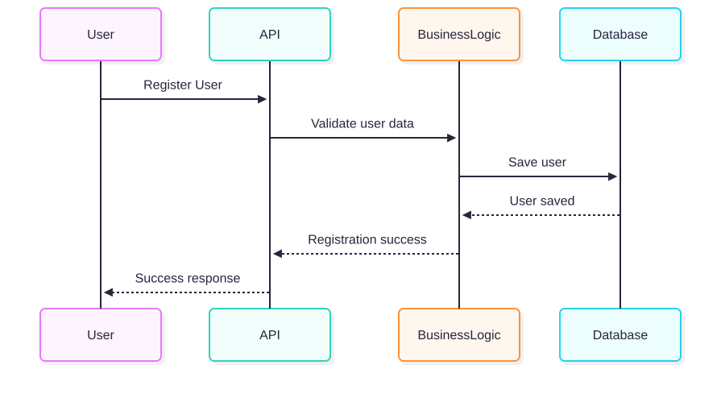
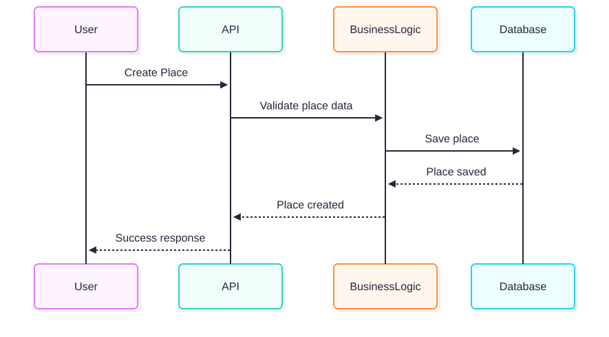
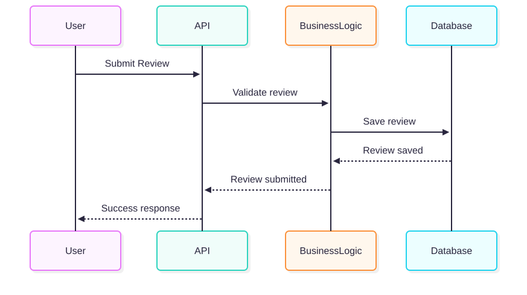
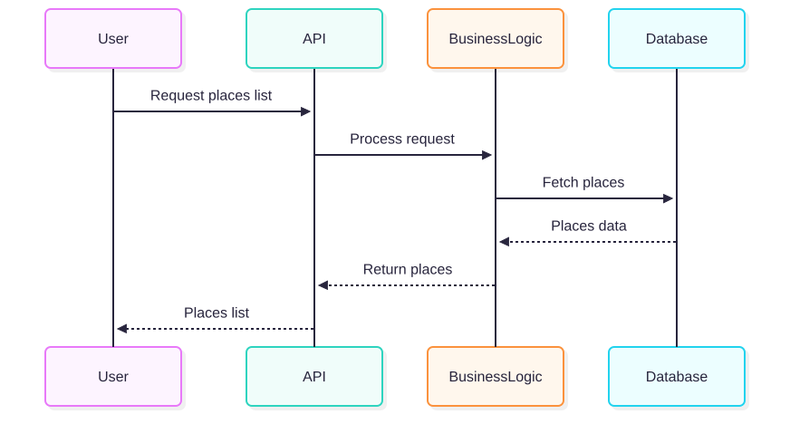

# Sequence Diagrams for API Calls
This document contains sequence diagrams that illustrate how different API calls
are handled within the HBnB application.  
Each diagram shows the interaction between the Presentation Layer (API),
Business Logic Layer, and Persistence Layer (Database).

## User Registration
This sequence diagram describes the process of user registration.
It shows how a user submits registration data through the API,
how the business logic validates the data, and how the user information
is stored in the database.

## Place Creation
This diagram illustrates how a user creates a new place listing.
The request is sent to the API, validated by the business logic,
and then saved in the database before returning a success response.

## Review Submission
This sequence diagram represents the process of submitting a review for a place.
It shows the validation of the review and its storage in the database.

## Fetching a List of Places
This diagram explains how a user requests a list of places.
The business logic processes the request, retrieves the data from the database,
and returns the list of places to the user.

